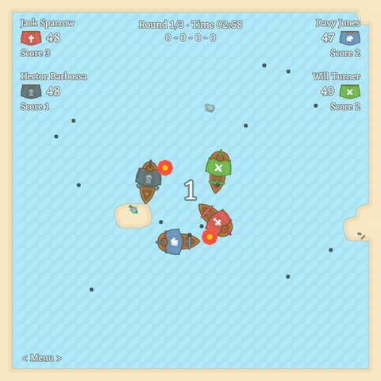
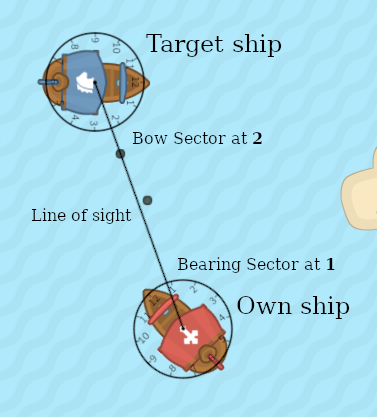

# Chaos Bo(a)ts @ js.talks("Bulgaria"); 2020

**js.talks("Bulgaria");** is a community event that will take place on **Friday and Saturday, November 20-21, 2020** for the sixth time in Bulgaria.

Chaos is challenging You to enter in a Great Sea Battle against ferocious opponents. Program your own Bo(a)t in this Open-source Coding Game by forking the GitHub repo and starting a Pull request.

<div align="center">



Latest Game build with Bo(a)ts Leaderboard is at http://martin.dimitrov.pages.chaosgroup.com/chaos-jstalks-2020.

</div>

## Entering the challenge

To enter the challenge and have your own Bo(a)t to compete against other players you create a Fork of this GitHub repo, prepare and test your contender code and start a Pull request to accept your score in the official game Leaderboard. Git is an essential tool in the hands of every developer, novice or seasoned and open-source code is the backbone for any modern software development. We want for You to be part of this culture and build together a fun and challenging experience. As with any open-source software it we will be welcome beside your Bo(a)t code to accept a new game features and improvements.

### Initial setup

This is a JavaScript project and its base local development requirements are `Node.js 14 LTS` and `yarn` or `npm`. Create a Fork of this GitHub repo, clone the new repo to your computer and start your development environment by running.

```bash
yarn
yarn start
```

An introduction about GitHub forks and Pull requests can be found at [Working with forks](https://docs.github.com/en/free-pro-team@latest/github/collaborating-with-issues-and-pull-requests/working-with-forks) and [Creating a pull request from a fork](https://docs.github.com/en/free-pro-team@latest/github/collaborating-with-issues-and-pull-requests/creating-a-pull-request-from-a-fork)

### What is a Bo(a)t

Bo(a)t is a Bot that controls battle Boat or a Boat that is being controlled by battle Bot, we are not completely sure... Once you have the development environment and game running in your browser (http://localhost:3001), you can check the current Leaderboard and battle boat bots that are already part of the game. The default battle setup is between two bots in three rounds and every round is three minutes long. Now the fun part begins, the code for every Bot can be found at `static/players/` folder. The Bot is defined by a single file and is essentially a function that on every player turn receives data about the battle environment and returns instructions for boat movement and cannon fire. Let's look at the simplest case, our `Dummy` bot:

```js
const onGameMessage = (typeof importScripts === 'function'
	? (importScripts('port.js'), self)
	: require('./port')
).port;

// stay in place
onGameMessage(() => ({
	speed: 0, // 0 -> 6
	rudder: 0, // -3 <- 0 -> +3
	fireSector: 0, // 0, 1 -> 12
}));
```

We can ignore the top import for now, it ensures the communication between the game and the bot and is important for automated rating battles. Our entry is `onGameMessage` function, it accepts a single callback function and in this case totally ignores the battle environment and returns fixed instructions to just stay in place. The `speed` parameter accepts values between `0` for Stop and `6` for Full Ahead. The `rudder` is `0` for heading straight, down to `-3` for steering left and up to `3` for steering right. The last parameter `fireSector` controls the cannon, `0` is for staying silent and every other number from `1` to `12` gives the direction of fire using analog clock hour sections. Our Bow(boat nose) is always on a 12-hour clock and for example the value of `3` is firing at our right side, `9` at left, `6` at back and so goes for every hour sector in between. Keep in mind this clock orientation because we are going to use it again for other angular relations in our game. With this we complete return instructions for the boat and will take a look at battle environment data next.

```js
onGameMessage(({ ownShip, targets }) => {
	//...
	return { speed, rudder, fireSector };
});
```

Battle environment data is about `ownShip` and array of enemy boats or just `targets`.

```js
ownShip: {
    health, // own health: 50 -> 0
    score, // successful enemy hits: 0 -> 50
    speed, // set speed: 0 -> 6
    rudder, // set rudder: -3 <- 0 -> +3
    fireSector, // set fire direction: 0, 1 -> 12
    blockedSector, // 0, 9 -> 11, 12, 1 -> 3,
}
```

The only parameter here that needs explanation is `blockedSector`. To ease our task as Bo(a)t developers we greatly reduced the amount of data that Bots need to process, in open sea battle the absolute boat position is less important than relative position against enemies. But our game map is not open sea and even has some obstacles for fun, `blockedSector` has a value different from `0` when our boat is against obstacles that prevents moving in the desired direction. Because the boat moves only forwards the range of values are in the upper half of clock hour sectors.

```js
targets: [
	{
		health, // target health: 50 -> 0
		score, // successful hits: 0 -> 50
		speed, // set speed: 0 -> 6
		range, // distance to target: 0 - 200 %
		bearingSector, // where is the target: 1 -> 12
		bowSector, // target orientation: 1 -> 12
	},
];
```

The array `targets` has data about enemies relative to our boat. The `range` is firing distance between two boats, we measure it in percent of cannon fire range, when less than `100` the enemy is in range and can be fired upon. Longer distances can have greater cannonball spread and less chance of successful hit, we are talking 17 century technology here.

<div align="center">



Own ship and target relation

</div>

`bearingSector` and `bowSector` give the relative orientation from Own Ship reference point and Line of sight with Target ship, once more it uses the already familiar clock sectors. Generally your `fireSector` will match the target `bearingSector` unless you want to improve accuracy by taking speeds into account.

## Your own Bo(a)t

You can start your own Bo(a)t by creating a new file in `static/players`, as a starting point copy one of the example ones. For better track of Bo(a)t ownership we are applying convention to use your GitHub user account as file name and optional suffix separated by underscore(`_`), for example `jacksparrow_two.js`. We will accept only Pull requests that honor this convention as this will allow for later code fixes and updates. The second step is to register your file in `src/players.json` and give it an appropriate name. Now your Bo(a)t will appear in the game menu and you can develop and test your code against existing bots. For faster development you can start battle and skip game menu by adding your opponents in `src/player.js`

```js
// set players to enter in game automatically
export const AUTOSTART = [PLAYERS.FiringDummy, PLAYERS.JackSparrow_Two];
```

The Bo(a)t rating for Leaderboard is done in a round-robin (or all-play-all) tournament in a speed-up headless simulated environment, the pair battle is in six rounds up to one minute each. We will run the tournament and update the Leaderboard once per 24 hours.
